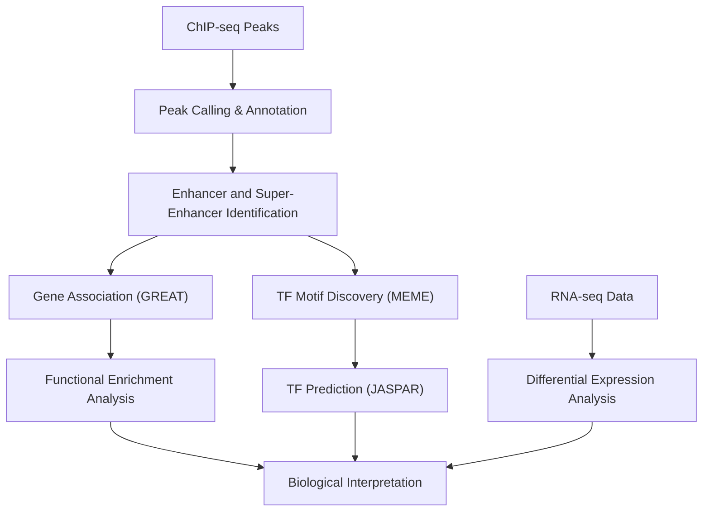

# 🔬 Challenge 12 — Unraveling Epigenetic Signatures Associated with Prognostic Gene Expression Profiles in Glioblastoma

<div align="center">

This folder documents an analysis of **ChIP-seq datasets in glioblastoma (GB)**. Analyses performed during the BioHackathon also included RNA-seq datasets; here, the focus is on **ChIP-seq interpretation and downstream biological insights**, while RNA-seq analyses contributed to the biological interpretation stage.

</div>

---

## 🌱 Project Overview

This project explores **epigenetic mechanisms contributing to glioblastoma progression**, with a focus on:

* Enhancers and **super-enhancers (SEs)**
* Putative gene regulation linked to **prognostic biomarkers**
* Transcription factor (TF) regulatory networks
* Analysis primarily of **ChIP-seq datasets**,with**RNA-seq analyses performed during the BioHackathon informing biological interpretation**



---

## 📂 Folder Structure

```
Challenge/
│
├── README.md  
├── Challenge12_Analysis_Report.md        # Full reproducible analysis report
└── Challenge12_Project.pdf              # Project presentation of results
```

---

## 📁 Project Contents

| File / Folder                    | Description                            | Link                                          |
| -------------------------------- | -------------------------------------- | --------------------------------------------- |
| `Challenge12_Analysis_Report.md` | Full reproducible analysis report      | [View Report](Challenge12_Analysis_Report.md) |
| `Challenge12_Project.pdf`        | Final presentation summarizing results | [View Presentation](Challenge12_Project.pdf)  |

---

## 🔗 Workflow & Tools

| Category            | Tools Used           | Purpose                                  |
| ------------------- | -------------------- | ---------------------------------------- |
| Peak Processing     | BedTools, (MACS2*)   | Peak calling and overlap analysis        |
| Peak Annotation     | ChIPseeker, GRanges  | Genomic annotation of peaks              |
| SE Identification   | Signal-based ranking | Detection of enhancers & super-enhancers |
| Gene Association    | GREAT                | Linking regulatory regions to genes      |
| Visualization       | IGV                  | Genome browser inspection                |
| Motif Analysis      | MEME Suite           | Motif discovery                          |
| TF Prediction       | JASPAR 2022          | TF binding prediction                    |
| RNA-seq Analysis    | DESeq2               | Differential gene expression             |
| Functional Analysis | ReactomePA           | Pathway enrichment                       |

> *Peaks are assumed to be called using standard approaches (e.g., MACS2 with typical significance thresholds), consistent with common ChIP-seq pipelines.*

---

## 📊 Dataset Summary

| Feature           | Description                                             |
| ----------------- | ------------------------------------------------------- |
| Disease Context   | Glioblastoma (GB)                                       |
| Data Types        | RNA-seq, ChIP-seq                                       |
| Epigenetic Marks  | Histone modifications (H3K4me1, H3K27ac)                |
| Focus             | Enhancers, Super-enhancers (SEs), TFs                   |
| Key Genes         | IDH, ATRX, CDKN2A, RHO                                  |
| Key Pathways      | Rho GTPase signaling, invasion, immune-related pathways |
| Platforms / Tools | R, Galaxy-compatible workflows                          |

---

## 🧠 Key Findings 

* **Enhancer Landscape:**
  H3K4me1 ChIP-seq analysis revealed subtype-specific enhancer distributions, with enrichment in distal intergenic and intronic regions, consistent with canonical enhancer localization.

* **Super-enhancer Identification:**
  A total of **224 putative super-enhancers** were identified based on H3K27ac signal enrichment and ranking approaches.

* **Functional Enrichment:**
  Pathway analysis highlighted enrichment in **Rho GTPase signaling**, receptor tyrosine kinase pathways, and extracellular matrix-related processes.

* **SE–Gene Association:**
  Using GREAT, SE regions were **associated with genes** including **IDH, ATRX, and CDKN2A**, which are well-established glioblastoma prognostic markers.

* **RHO Regulatory Region:**
  A **putative super-enhancer ~20 kb upstream of the RHO locus** was identified, suggesting a potential regulatory role in pathways linked to glioblastoma cell motility and invasion.

* **Motif Analysis:**
  Motif discovery identified enriched DNA binding patterns within SE regions. Functional predictions suggest associations with transcriptional regulation and developmental processes.

* **Transcription Factor Prediction:**
  Motif enrichment analysis suggests potential binding of TFs including **RREB1, EGR1, KLF9, ZSCAN4, MSANTD3, and NR5A1**, several of which have documented roles in glioma biology.
  
* **Notes**

> All regulatory relationships reported here represent **computational predictions and associations**, requiring experimental validation.  
> This study provides a **hypothesis-generating framework** for understanding super-enhancer–driven regulatory mechanisms in glioblastoma and highlights candidate regulatory regions and transcription factors for future experimental validation.

---

## 🌟 Relevance to My Field

As an MSc candidate in Biochemistry & Molecular Biology specializing in **Molecular Cancer Biology and Bioinformatics**, this project provided:

* Hands-on experience in **(ChIP-seq analysis, RNA-seq interpretation)**
* Practical understanding of **enhancer and super-enhancer biology in cancer**
* Training in **linking chromatin states to transcriptional programs**
* Experience identifying **putative regulatory elements linked to prognostic genes**
* Exposure to **transcription factor network inference in tumor systems**

This work aligns with my interest in **neuro-oncology**, particularly in understanding how **epigenetic landscapes influence tumor behavior and disease progression**, and supports my goal of contributing to **biomarker discovery and cancer research**.

---

## 🧠 Skills Acquired

| Category             | Skills                                                    |
| -------------------- | --------------------------------------------------------- |
| Bioinformatics       | ChIP-seq analysis, RNA-seq interpretation, enhancer analysis |
| Data Analysis        | Functional enrichment, motif discovery, TF prediction     |
| Computational        | R programming, workflow design, reproducible research     |
| Visualization        | IGV genome browsing, biological interpretation            |
| Scientific Reporting | Technical writing, structured documentation               |

---

## Team


| Name                 | Role                                 | Affiliation                                                                    |
| -------------------- | ------------------------------------ | ------------------------------------------------------------------------------ |
| Dr. Salma M. Abozeid | **Supervisor**                       | Lecturer & Postdoctoral Fellow, German University in Cairo (GUC)               |
| Maria Nasser         | **Team Member (Graduation Student)** | Faculty of Pharmacy & Biotechnology, GUC                                       |
| Mohamed H. Hussein   | **Team Member (M.Sc. Candidate)**    | M.Sc. Candidate, Biochemistry & Molecular Biology, Ain Shams University, Egypt |


## Author Contribution

**Mohamed H. Hussein — MSc Candidate, Biochemistry & Molecular Biology, Ain Shams University**

* Participated in **data analysis, presentation preparation, and biological interpretation of datasets** during the BioHackathon
* Independently prepared the **comprehensive analysis report** after the Biohackathon
* Documented and clarified the **existing computational workflow** for reproducibility and academic use

---

## 📝 Citation & Usage

This folder is part of the **Research-Trainings-2024** repository.

**Citation:**

Hussein, Mohamed H. (2025). *Research Training 2024* [ Summary, Notes,and Project]. GitHub repository: [https://github.com/Mohamed-H-Hussein/Research-Trainings-2024](https://github.com/Mohamed-H-Hussein/Research-Trainings-2024)

---

## ⚖️ License

[](https://creativecommons.org/licenses/by-nc/4.0/)

This folder is licensed under the **Creative Commons Attribution-NonCommercial 4.0 International License (CC BY-NC 4.0)**.
Full license: [https://creativecommons.org/licenses/by-nc/4.0/legalcode](https://creativecommons.org/licenses/by-nc/4.0/legalcode)

---

© 2025 Mohamed H. Hussein. All workflows and analysis are provided "as is" without warranty.
