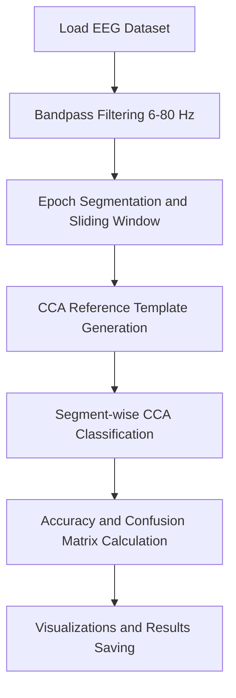

# 🧠 Machine Learning-Based EEG Analysis: Canonical Correlation Analysis for SSVEP Detection

<div align="center">
    
This folder documents the **full analysis of Steady-State Visual Evoked Potential (SSVEP) EEG signals** using **Canonical Correlation Analysis (CCA)** for multi-subject classification, including documented workflows, visualizations, and reproducible reporting.

</div>

---

## 🌟 Project Overview

This project implements **CCA-based SSVEP detection** for EEG signals across **10 subjects**, aiming at **segment-level classification** in a Brain–Computer Interface (BCI) system. The analysis pipeline covers:

* Multi-class EEG segmentation and preprocessing
* Bandpass filtering (6–80 Hz)
* Reference template generation for stimulus frequencies
* CCA computation for SSVEP detection
* Classification accuracy evaluation and visualization



---

## 📂 Folder Structure

```
Project/
│
├── README.md
├── SSVEP-CCA-Analysis-Report.md           # Main analysis report
├── presentation/
│     └── SSVEP-CCA-Project-Presentation.pdf   # Final presentation slides
├── scripts/
│     └── SSVEP_CCA_Analysis_Project_Notebook.ipynb  # Jupyter Notebook pipeline
├── results/
│     └── cca_ssvep_results.xls           # Final results in Excel
├── figures/
│     ├── .gitkeep
│     ├── accuracy_boxplot.png
│     ├── accuracy_per_subject.png
│     ├── confusion_matrix_last_subject.png
│     ├── max_cca_corr_hist_last_subject.png
│     ├── sample_eeg_signal.png
│     └── true_vs_predicted_labels.png
└── data/
      ├── s1.mat
      ├── s2.mat
      ├── s3.mat
      ├── s4.mat
      ├── s5.mat
      ├── s6.mat
      ├── s7.mat
      ├── s8.mat
      ├── s9.mat
      └── s10.mat
```

---

## 📁 Project Contents

| File / Folder                  | Description                                   | Link                                                                 |
| ------------------------------ | --------------------------------------------- | -------------------------------------------------------------------- |
| `SSVEP-CCA-Analysis-Report.md` | Full project report and analysis              | [View Report](SSVEP-CCA-Analysis-Report.md)                          |
| `presentation/`                | Project presentation slides                   | [View Presentation](presentation/SSVEP-CCA-Project-Presentation.pdf) |
| `scripts/`                     | Jupyter Notebook with full CCA workflow       | [View Notebook](scripts/SSVEP_CCA_Analysis_Project_Notebook.ipynb)   |
| `results/`                     | Excel results of segment-level classification | [View Results](results/cca_ssvep_results.xls)                        |
| `figures/`                     | Visualizations (accuracy, confusion matrices) | [View Figures](figures/)                                             |
| `data/`                        | Raw EEG dataset (.mat)                        | [View Data](data/)                                                   |

---

## 🔗 Workflow & Resources

| Resource          | Description                                      | Link                                                                                    |
| ----------------- | ------------------------------------------------ | --------------------------------------------------------------------------------------- |
| EEG Dataset       | 12-class SSVEP EEG recordings across 10 subjects | [GitHub Dataset](https://github.com/mnakanishi/12JFPM_SSVEP/tree/master/data)           |
| Reference Paper   | CCA-based SSVEP detection methods                | [Nakanishi et al., 2015](https://doi.org/10.1371/journal.pone.0140703)                  |
| Analysis Notebook | Reproducible CCA pipeline                        | [Jupyter Notebook](./scripts/SSVEP_CCA_Analysis_Project_Notebook.ipynb)                 |
| Presentation      | Project summary slides                           | [SSVEP-CCA-Project-Presentation.pdf](./presentation/SSVEP-CCA-Project-Presentation.pdf) |

---

## 📊 Dataset Summary

| Feature           | Description                                  |
| ----------------- | -------------------------------------------- |
| Subjects          | 10 human participants                        |
| Channels          | 8 EEG channels                               |
| Sampling Rate     | 256 Hz                                       |
| Classes (Stimuli) | 12 flickering frequencies                    |
| Trials per Class  | 15                                           |
| Signal Processing | Band-pass 6–80 Hz, artifact rejection        |
| Analysis Method   | Canonical Correlation Analysis (CCA)         |
| Accuracy Range    | 26.4% – 91.3% across subjects                |
| Mean Accuracy     | 59.5%                                        |
| Visualization     | Accuracy plots, boxplots, confusion matrices |

---

## 🌟 Relevance to My Field

As an MSc candidate in **Biochemistry & Molecular Biology** with a focus on **Molecular Cancer Biology and Bioinformatics**, this project provided:

* Hands-on experience in **EEG signal processing and machine learning-based classification**
* **Reproducible analysis workflow** development using Python and Jupyter
* Practical skills in **CCA-based detection and evaluation of neural signals**
* Experience linking **raw data → analysis code → visualizations → report**
* Exposure to **interdisciplinary research integrating neurotechnology, computational analysis, and molecular biology**, relevant to **neuroscience, neuro-oncology, and bioinformatics applications**

---

## 🧠 Skills Acquired

| Category              | Skills                                                                         |
| --------------------- | ------------------------------------------------------------------------------ |
| EEG Signal Processing | Bandpass filtering, epoch segmentation, sliding window analysis                |
| Machine Learning      | Canonical Correlation Analysis (CCA), classification, accuracy evaluation      |
| Data Analysis         | Confusion matrices, correlation histograms, subject-wise performance analysis  |
| Visualization         | Line plots, boxplots, heatmaps, correlation histograms                         |
| Computational Skills  | Python scripting, Jupyter Notebook, reproducible workflows, GitHub publication |
| Scientific Reporting  | Project report preparation, figure annotation, presentation development        |

---

## Team

| Name               | Affiliation                                                                    |
| ------------------ | ------------------------------------------------------------------------------ |
| Mohamed H. Hussein | M.Sc. Candidate, Biochemistry & Molecular Biology, Ain Shams University, Egypt |
| Hasnaa Hossam      | Senior Student, Systems & Biomedical Engineering, Cairo University, Egypt      |

---

## Author Contribution

**Mohamed H. Hussein — MSc Candidate, Biochemistry & Molecular Biology, Ain Shams University**

* Performed **EEG signal preprocessing**, **feature extraction**, and **machine learning analysis** in the project.
* Co-developed the **project presentation** with a teammate, enhanced the initial **Jupyter Notebook** based on workshop materials, and jointly presented the results.
* Re-engineered **independently** the **entire Jupyter Notebook code** and substantially improved it to produce a **fully reproducible workflow**, including **enhanced processing steps**,**figures**, **clearer documentation**, and a **clean, structured analytical pipeline** suitable for public sharing and reuse.
* Prepared **independently** the complete **Analysis Project Report**.
* Created **independently** the entire **GitHub folder**, including all **Jupyter Notebooks**, **presentation slides**, and the **project Analysis Report**, with a **well-organized folder structure** ensuring clarity and easy navigation.
---

## 📝 Citation & Usage

This folder is part of the **Research-Trainings-2024** repository.

**Citation:**

Hussein, Mohamed H. (2025). *Research Training 2024* [ Summary, Notes,and Project]. GitHub repository: [https://github.com/Mohamed-H-Hussein/Research-Trainings-2024](https://github.com/Mohamed-H-Hussein/Research-Trainings-2024)

---

## ⚖️ License

[](https://creativecommons.org/licenses/by-nc/4.0/)

This folder is licensed under the **Creative Commons Attribution-NonCommercial 4.0 International License (CC BY-NC 4.0)**.
Full license: [https://creativecommons.org/licenses/by-nc/4.0/legalcode](https://creativecommons.org/licenses/by-nc/4.0/legalcode)

---

© 2025 Mohamed H. Hussein. All workflows and analysis are provided "as is" without warranty.
