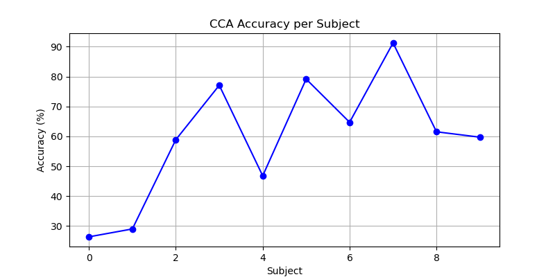
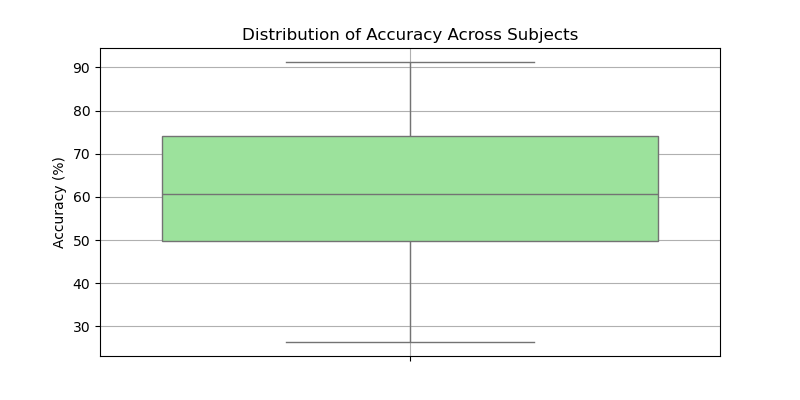
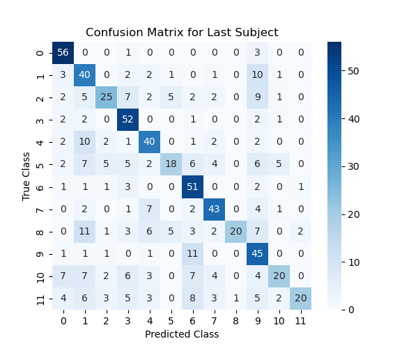
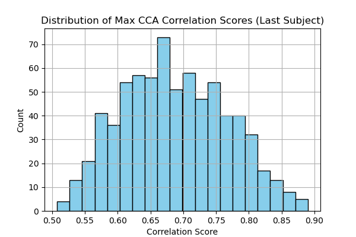
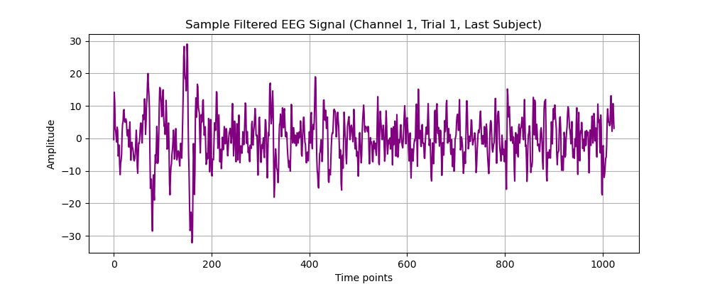
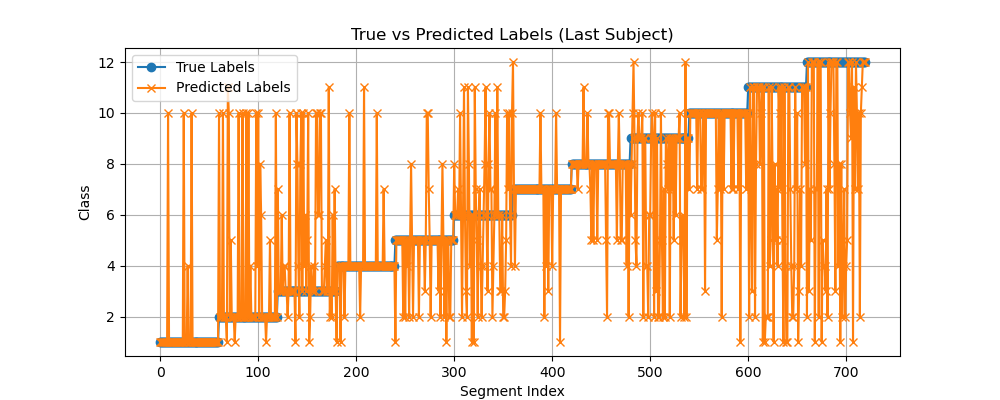

# 🔬 Project Analysis Report 

**Canonical Correlation Analysis for SSVEP Detection**     
**Last Updated:** December 4, 2025

**Team:**

* **Mohamed Hossam (Mohamed H. Hussein)** – M.Sc. Candidate, Biochemistry & Molecular Biology, Ain Shams University, Cairo, Egypt
* **Hasnaa Hossam** – Senior Student, Systems & Biomedical Engineering, Cairo University

*Note: This report reflects the updated implementation and analysis pipeline prepared by Mohamed H. Hussein. All analyses are reproducible and code is available for GitHub submission.*

---

## Resources

* **Input Data:** [Data](./data)
* **Output Results:** [cca_ssvep_results](./results/cca_ssvep_results.xls)
* **Output Results:** [Figures](./figures)
* **Script / Notebook:** [SSVEP_CCA_Analysis_Project_Notebook](./scripts/SSVEP_CCA_Analysis_Project_Notebook.ipynb)
* **Presentation Slides:** [SSVEP-CCA-Project-Presentation](./presentation/SSVEP-CCA-Project-Presentation.pdf)
---

## Table of Contents

* [I. Objective & Overview](#i-objective--overview)
* [II. Scope](#ii-scope)
* [III. Tools & Environment](#iii-tools--environment)
* [IV. Introduction](#iv-introduction)
* [V. System Architecture](#v-system-architecture)
* [VI. Data Preprocessing](#vi-data-preprocessing)
* [VII. Workflow (Code Pipeline)](#vii-workflow-code-pipeline)
* [VIII. Canonical Correlation Analysis (CCA)](#viii-canonical-correlation-analysis-cca)
* [IX. Results & Visualizations](#ix-results--visualizations)
* [X. Future Improvements](#x-future-improvements)
* [XI. Conclusion](#xi-conclusion)

---

## I. Objective & Overview

**Objective:**
Implement Canonical Correlation Analysis (CCA) for real-time classification of EEG signals in an SSVEP-based BCI system, with reproducible multi-subject analysis.

**Key Features:**

* Segment-level SSVEP classification
* CCA-based detection using reference templates (sinusoidal signals and harmonics)
* Multi-subject and multi-class operation
* Reproducible, modular pipeline for GitHub sharing and further research

---

## II. Scope

Covers the **computational workflow** for **SSVEP classification using CCA**, including:

* **EEG Preprocessing:** Band-pass filtering (6–80 Hz), segmentation, artifact handling
* **CCA-based analysis:** Correlation with reference templates for each stimulus frequency
* **Classification workflow:** Segmenting EEG, generating reference signals, computing correlation, predicting classes, evaluating accuracy

**Not included:**

* Hardware acquisition specifics
* Experimental protocols or raw EEG storage (kept in separate dataset folder)

---

## III. Tools & Environment

**Programming Language:** Python 3.10

**Libraries / Packages:**

* NumPy, SciPy – signal processing and array operations
* scikit-learn – CCA and evaluation metrics
* pandas – data management and CSV export
* matplotlib, seaborn – visualizations
* MNE-Python (optional) – EEG handling

**Development Environment:** Jupyter Notebook

**Version Control & Data Management:** Git for code versioning, dataset downloaded from GitHub

**Hardware / Platform:** Tested on macOS/Linux, EEG dataset: 12-class publicly available SSVEP dataset (256 Hz, 8 channels, 15 trials per class)                 
**Dataset URL:** [12-Class SSVEP EEG Dataset](https://github.com/mnakanishi/12JFPM_SSVEP/tree/master/data)   
**Reference Paper:** Masaki Nakanishi, Yijun Wang, Yu-Te Wang, Tzyy-Ping Jung, *“A Comparison Study of Canonical Correlation Analysis Based Methods for Detecting Steady-State Visual Evoked Potentials”*, PLoS One, 2015, vol.10, e140703

---

## IV. Introduction

Steady-State Visual Evoked Potentials (SSVEPs) are periodic neural responses generated when an individual fixates on a flickering visual stimulus. Their stable, frequency-locked nature makes them ideal for Brain–Computer Interface (BCI) applications. 

This project demonstrates **CCA-based SSVEP frequency detection** on a multi-subject dataset with modular, reproducible code.

---

## V. System Architecture

**Pipeline Overview:**

1. EEG Acquisition
2. Preprocessing: filtering, artifact handling
3. Epoch segmentation (with latency correction)
4. CCA-based analysis (segment vs reference templates)
5. Frequency classification output
6. Performance evaluation and visualization

---

## VI. Data Preprocessing

* **Band-pass filtering:** 6–80 Hz (Butterworth, zero-phase)
* **Artifact handling:** Manual rejection of large artifacts, minimize blinking
* **Segmentation:** Windows of 1s length, shift 1s, onset latency compensation (135 ms)
* **Sliding window buffer:** Enables segment-level classification

---

## VII. Workflow (Code Pipeline)

1. **Load Dataset:** Import `.mat` EEG files per subject
2. **Filtering:** Apply Butterworth bandpass (6–80 Hz)
3. **Epoching:** Extract 1s segments per trial with 1s shift
4. **Generate Reference Signals:** Sine/cosine of fundamental + second harmonic for each stimulus frequency
5. **CCA Computation:** Compare EEG segments with reference templates
6. **Classification:** Segment-level predicted class via max canonical correlation
7. **Evaluation:** Accuracy per subject, confusion matrix, visualizations

---

## VIII. Canonical Correlation Analysis (CCA)

CCA correlates multichannel EEG with reference templates:

* **Reference Signals:**

  * sin(2πft), cos(2πft)
  * sin(4πft), cos(4πft)

**Advantages:**

* No calibration required
* Robust across subjects
* Fast computation
* Works with few channels

---

## IX. Results & Visualizations

**Accuracy per Subject (Real Results from Pipeline):**

| Subject | Accuracy (%) |
| ------- | ------------ |
| S1      | 26.39        |
| S2      | 29.03        |
| S3      | 58.89        |
| S4      | 77.08        |
| S5      | 46.81        |
| S6      | 79.17        |
| S7      | 64.72        |
| S8      | 91.25        |
| S9      | 61.53        |
| S10     | 59.72        |

**Mean Accuracy:** 59.46%    
**Std Dev:** 19.80%   
**Best Subject:** S8 (91.25%)    
**Worst Subject:** S1 (26.39%)    

**Analysis:**

* Accuracy varies significantly across subjects (from 26.39% to 91.25%), reflecting individual variability in SSVEP response and signal quality.
* Subjects with high accuracy (S4, S6, S8) suggest stronger signal-to-noise ratios or better electrode placement.
* Lower accuracy in S1 and S2 may indicate higher artifacts, weaker SSVEP responses, or need for subject-specific calibration (e.g., IT-CCA).
* Mean accuracy (≈59.5%) aligns with expected performance for standard CCA on multi-subject SSVEP datasets without subject-specific templates.
* High standard deviation (19.8%) highlights inter-subject variability and the importance of adaptive or personalized preprocessing and classification approaches.

**Visualizations:**

* **Accuracy per subject:**
  
* **Distribution across subjects (Boxplot):**
          
* **Confusion matrix (last subject):**        
  
* **Histogram of max CCA correlation scores (last subject):**
  
* **Sample EEG segment (channel 1, trial 1, last subject):**
  
* **True vs Predicted Labels (last subject):**
  

---

## X. Future Improvements

1. **Individual Template CCA (IT-CCA):** Personalized modeling for each subject to reduce variability
2. **Additional channels & harmonics:** Better spatial/harmonic resolution to improve accuracy
3. **Adaptive filters & artifact handling:** Real-time drift/noise correction
4. **Pipeline automation:** Streamlined GitHub-ready reproducible workflow

---

## XI. Conclusion

This project demonstrates **robust, segment-level CCA classification for SSVEP detection** across multiple subjects. Key insights:

* Multi-subject reproducible pipeline allows direct comparison and benchmarking
* Segment-level evaluation highlights inter-subject variability
* Figures summarizing accuracy, correlation scores, and prediction reliability provide clear insight into model performance
* Future improvements can focus on IT-CCA, adaptive preprocessing, and inclusion of more channels for enhanced accuracy

